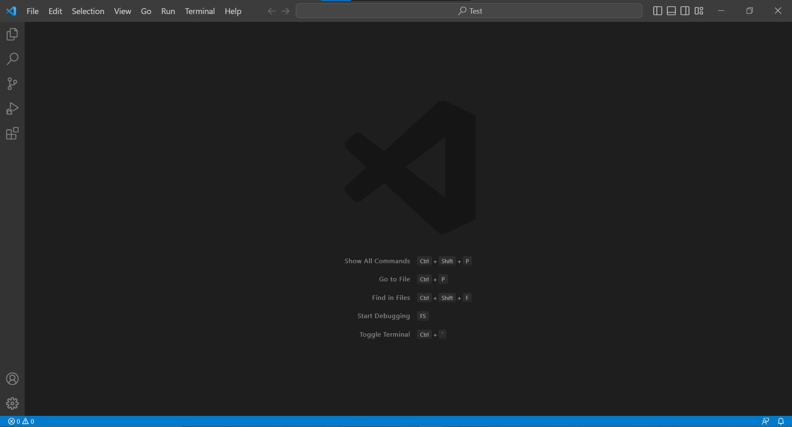
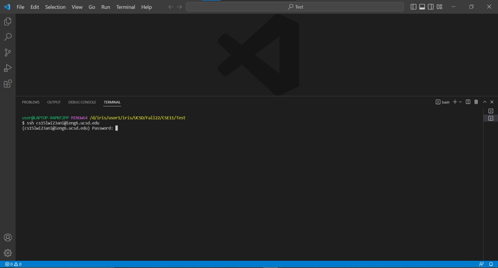
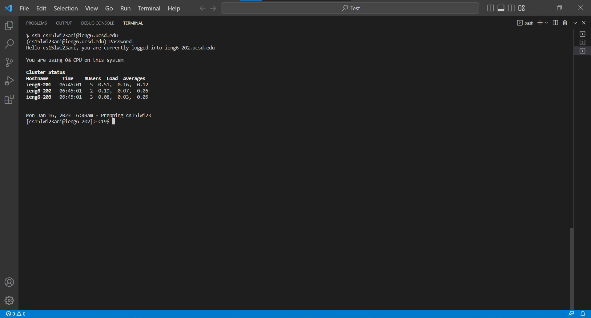
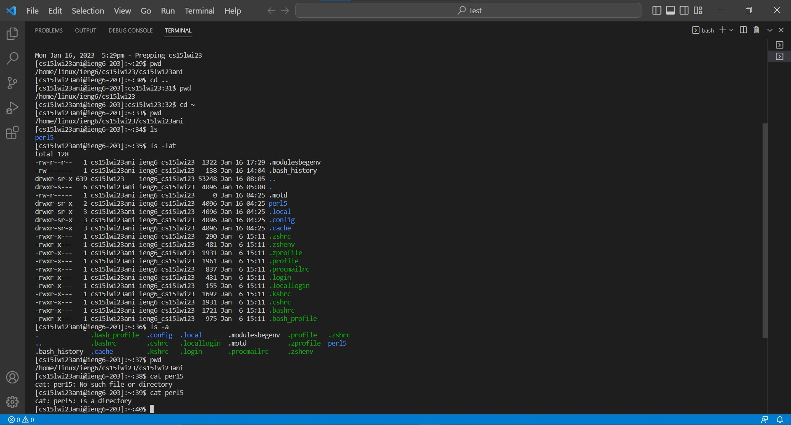

Hello, everyone. Today we will learn how to log into a course-specific account on ieng6.

# Part 1 - Installing VScode
## Haven't installed
Go to the Visual Studio Code website([Link](https://code.visualstudio.com/)) and follow the 
instructions to install it on your computer. (`Notice`: There are three versions of downloading. 
One for macOS system. Another for Windows system. The other for Linux x64 system.)

After finishing installing, follow the steps in Already installed part.

## Already installed
Open the Visual Studio Code on your computer. After opening, you will see the following 
window on your screen.(It might be a slightly different because of different computer system.)


(Because I have already installed the Visual Studio Code on my computer, I can only do the Already installed part 
and show the picture of that part.)

# Part 2 - Remotely Connecting
Now, we will learn how to use VScode/terminal to remotely connect to a computer.

## For Windows system
(If your computer system is not Windows, skip this part and jump to Start connect part.)

Install [`git`](https://gitforwindows.org/) first. After finishing installing, follow the steps in 
[Using Bash on Windows in VScode](https://stackoverflow.com/questions/42606837/how-do-i-use-bash-on-windows-from-the-visual-studio-code-integrated-terminal/50527994#50527994) 
to set your default terminal to `git bash` in the Visual Studio Code.

## Start connect
1. Open a terminal in VScode.(Ctrl or Command + `, or use Terminal tab on the upper bar and choose New Terminal option.)

2. Type in the following text in the terminal and press enter.
`$ ssh cs15lwi23ani@ieng6.ucsd.edu`
(`Notice`: You do not need to type in `$` because it already exists in the terminal. The letter after s is one. The letter after 5 is l, lowercase of L. Remember to replace ani by the letters in your course-specific account.)

3. If this is the first time you connect to this server, you will see the following message appear in the terminal. 
If this is not the first time you connect to this server, jump to step 5.
```
$ ssh cs15lwi23ani@ieng6.ucsd.edu
The authenticity of host 'ieng6.ucsd.edu (128.54.70.227)' can't be established.
RSA key fingerprint is SHA256:ksruYwhnYH+sySHnHAtLUHngrPEyZTDl/1x99wUQcec.
Are you sure you want to continue connecting (yes/no/[fingerprint])? 
```
(Because this is my second time to connect to this server, I do not have picture to show on.)
4. Type in `yes` and press enter.
5. The terminal will ask you to enter password. Type in your password.
(`Notice`: When you are typing your password, it is normal that you do not see anything appear or change in the terminal.)

`Notice`: If you forget your password, please follow the instructions 
[here](https://docs.google.com/document/d/1hs7CyQeh-MdUfM9uv99i8tqfneos6Y8bDU0uhn1wqho/edit) to reset your password.
6. After logging in successfully, you will see the following window on your screen.(The window on your screen might be slightly different than mine.)

`Notice`: If the terminal keep ask you to enter your password, then the password you type in might be wrong.

7. Congratulation! You already remotely connect to a computer in the CSE basement. Any commands you run will also run on that computer.
(Your computer is called the client, the computer in the CSE basement is called the server.)

# Part 3 - Trying Some Commands
## Useful command list:
- `cd` Change the current Working Directory to the path you enter
- `cd ~` Change the current Working Directory to Home Directory
- `cd ..` Change the current Working Directory to the directory "above" or "outside" the current directory
- `ls` List all of the files and folders in the current Working Directory
- `ls -lat`
- `ls -a`
- `pwd` Print the current Working Directory
- `cat` Print the contents of the file given by the path you enter

## Example:

1. The first command I ran is `pwd` (in line 29), it prints out the current Working Directory, and the output should be `/home/linux/ieng6/cs15lwi23/cs15lwi23ani`, which is also refer as Home Directory. (`Notice`: The output shown on your terminal might be slightly different than mine. It will be `/home/linux/ieng6/cs15lwi23/cs15lwi23...`. The system will replace ani by the letters in your course-specific account.)
3. The second command I ran is `cd..` (in line 30), it changes the current Working Directory to the directory "above" or "outside" the current directory, and no output is shown.
4. The third command I ran is `pwd` (in line 31), it prints out the current Working Directory. Because I changed the current Working Directory in last command, the output should be `/home/linux/ieng6/cs15lwi23`, which is the directory "outside" Home Directory(`/home/linux/ieng6/cs15lwi23/cs15lwi23ani`).
5. The fourth command I ran is `cd ~` (in line 32), it changes the current Working Directory to Home Directory, and no output is shown.
6. The fifth command I ran is `pwd` (in line 33), it prints out the current Working Directory. Because I changed the current Working Directory to Home Directory in last command, the output should be `/home/linux/ieng6/cs15lwi23/cs15lwi23ani`.
7. The sixth command I ran is `ls` (in line 34), it lists all of the files, folders, and directory in the current Working Directory, and the output should be `perl5`.
8. The seventh command I ran is `ls -lat` (in line 35) and the output should be `total 128...`
9. The eighth command I ran is `ls -a` (in line 36) and the output should be `. .bash_profile .config .local...`
10. The nineth command I ran is `pwd` (in line 37), it prints out the current Working Directory, and the output should be `/home/linux/ieng6/cs15lwi23/cs15lwi23ani` since I do not change the current Working Directory between line 34 to line 37. Therefore, the output should be the same as the output in line 33.
11. The tenth command I ran is `cat per15` (in line 38), it prints out the contents of the file given by the path I enter, and the output should be `cat: per15: No such file or directory`. Since the path I enter is wrong, the output shows me that the path I enter cannot be found.
12. The last command I ran is `cat perl5` (in line 39), it prints out the contents of the file given by the path I enter, and the output should be `cat: perl5: Is a directory`. Since the path I enter is not the file(I.e .java/.text), the output shows me that the path I enter is a directory. (`Notice`: The difference between line 38 and line 39 is that the path I enter in line 38 is `per15`(one five) and the path I enter in line 39 is `perl5`(L five).)

`pwd` is the useful command to check the current Working Directory. Therefore, whenever I make some changes on the current Working Directory, I will use it to check.

`Notice`: Please feel free to ask whenever you have question.
