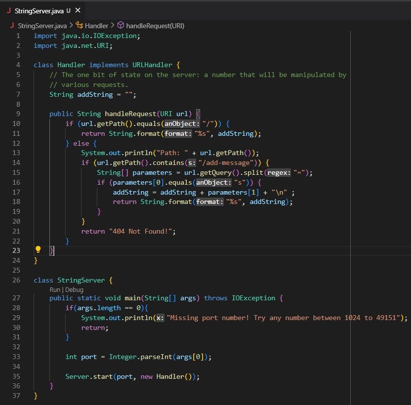
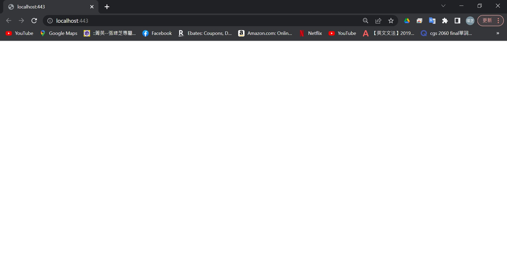
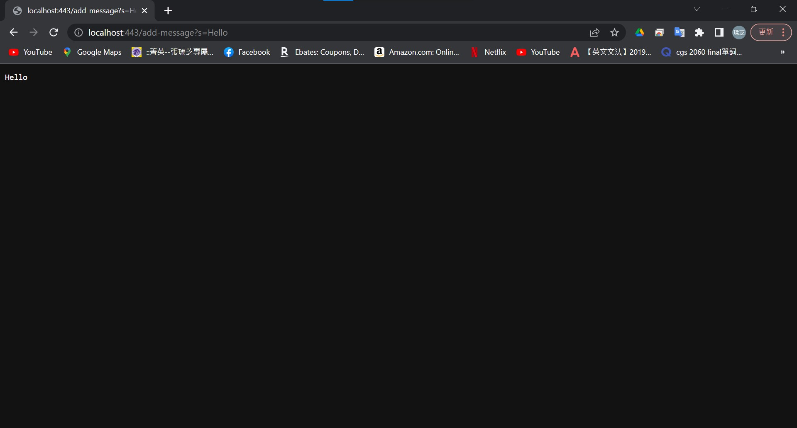
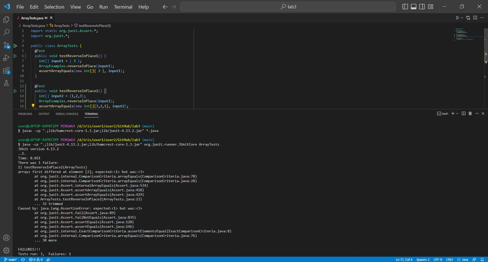

Hello, everyone. Today we will learn how to write a web server in part 1, learn the concepts about symptoms and failure-inducing inputs in part 2, and know what I learned from lab in week 2 or 3 in part 3.

# Part 1 - Write a web server
I wrote a web server called StringServer that the user can keep adding a single string to web server by each request.
`Code:`


`Before making any requests:`


`After making two requests:`

1. Which methods in my code are called for this screenshot?
For this screenshot, when I use `/add-message?s=Hello` to make the request, the `String handleRequest(URI url)` method is called.
2. What are the relevant arguments to those methods, and the values of any relevant fields of the class?
The relevant argument to the `String handleRequest(URI url)` method is `URI url`.
(`Notice`: URI is the data type of the relevant argument, and url is the name of the relevant argument.)
`String[] parameters` and `String addString` are the relevant fields in `Handler` class. `No value` is in `String[] parameters` and `String addString`.
3. How do the values of any relevant fields of the class change from this specific request? If no values got changed, explain why.
After we make the specific request(Here means add "Hello" to web server.), the values in `String[] parameters` is changed to `"s", "Hello"`. In order to extract these values, the system splits "=" in url, and make "s" in index 0, "Hello" in index 1. Moreover, the value of `String addString` is also changed to `parameters[1] + "\n"`. In order to get this value, I use the value in `String[] parameters`'s index 1 and the code for a new line.


1. Which methods in my code are called for this screenshot?
For this screenshot, when I use `/add-message?s=Hi` to make the request, the `String handleRequest(URI url)` method is called.
2. What are the relevant arguments to those methods, and the values of any relevant fields of the class?
The relevant argument to the `String handleRequest(URI url)` method is `URI url`.
(`Notice`: URI is the data type of the relevant argument, and url is the name of the relevant argument.)
`String[] parameters` and `String addString` are the relevant fields in `Handler` class. The values in `String[] parameters` is `"s", "Hello"` and the value of `String addString` is `parameters[1] + "\n"`.
3. How do the values of any relevant fields of the class change from this specific request? If no values got changed, explain why.
After we make the specific request(Here means add "Hi" to web server.), the values in `String[] parameters` is changed to `"s", "Hi"`. In order to extract these values, the system splits "=" in url, and make "s" in index 0, "Hi" in index 1. Moreover, the value of `String addString` is also changed to `parameters[1] + "\n"`. In order to get this value, I use the value in `String[] parameters`'s index 1 and the code for a new line.

# Part 2 - Symptoms and Failure-inducing Inputs
There are some bugs in two methods, `reverseInPlace` and `reversed`, in `ArrayExamples.java`. I choose to modify `reverseInPlace` in order to identify the bugs, the failure-inducing input, and the symptom for it.
1. Failure-inducing input:
```
input:
{1,2,3}

code:
@Test
  public void testReverseInPlace2() {
    int[] input2 = {1,2,3};
    ArrayExamples.reverseInPlace(input2);
    assertArrayEquals(new int[]{3,2,1}, input2);
  }
```
2. Input that does not induce a failure:
```
input:
{3}

code:
@Test
  public void testReverseInPlace1() {
    int[] input1 = { 3 };
    ArrayExamples.reverseInPlace(input1);
    assertArrayEquals(new int[]{ 3 }, input1);
	}
```
3. Symptom:

4. The bug:
- Before:
```
static void reverseInPlace(int[] arr) {
    for(int i = 0; i < arr.length; i += 1) {
      arr[i] = arr[arr.length - i - 1];
    }
  }
```
- After:
```
static void reverseInPlace(int[] arr) {
    for(int i = 0; i != arr.length/2; i += 1) {
      int temp = arr[i];
      arr[i] = arr[arr.length - i -1];
      arr[arr.length - i - 1] = temp;
    }
  }
```
The reason why the fix addresses the issue is because in each loop, I let the value of the lower index stored in `int temp`. By doing this, I will not miss the value of the lower index and am able to assign it to the upper index. When i == arr.length/2, all elements are reversed. Therefore, I can break out the loop.

# Part 3 - What I learned from lab in week 2 or 3
In week 2, I learned how to build the server, run the server both on a local computer and a remote computer. It is really cool. By learning these things, I can change the output on the server and run the server even I do not have a local computer in hand.
In week 3, I learned the concepts of symptoms and failure-inducing inputs. Moreover, I also learned how to use Junit to run the tester file. I consider it is really helpful for us to debug the code.
