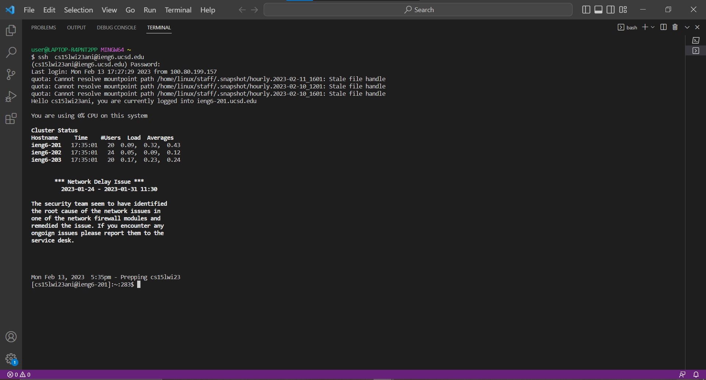
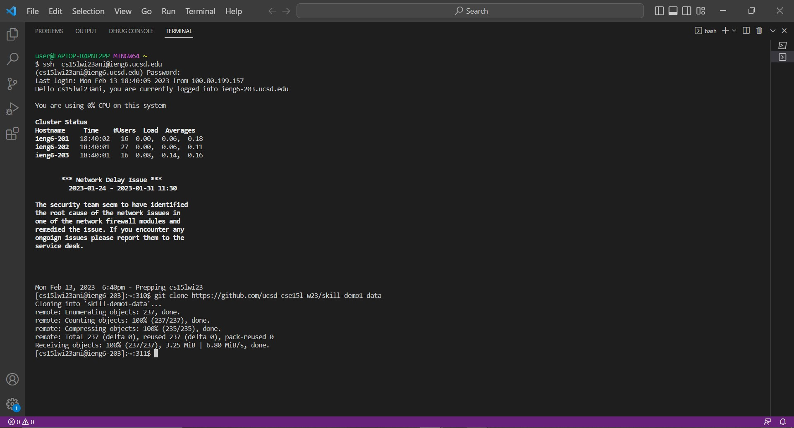

Hello, everyone. Today we will discuss the `find` command-line options.

`find` is a useful command that help the user to find the files, the words in specified files, and the directories.
## Before start:
In order to show the `find` command-line options and its output easily, we need to set up our evironment first.
1. Use ctrl or Command + ` to open a new bash terminal in Visual Studio Code.
2. Log into your course-specific ieng6 account:

(`Notice`:You do not need to type in `$` because it already exists in the terminal. 
The letter after s is one. The letter after 5 is l, lowercase of L. 
Remember to replace ani by the letters in your course-specific account.)
3. Type in your password:

(`Notice`: When you are typing your password, it is normal that you do not see anything appear or change in the terminal.)
4. Successful log in:

(`Notice`: If the terminal keep ask you to enter your password, then the password you type in might be wrong.)
5. Use `git clone https://github.com/ucsd-cse15l-w23/skill-demo1-data` to clone the file into our course-specific account.

(`Notice`: If you clone the file successfully, your screen should be the same as the above image.)
6. Use `cd skill-demo1-data` to switch the current working directory to skill-demo1-data. 
7. Complete set up the evironment and ready for showing find command-line.
# The first `find` command-line options is `-name`.
`-name` is used to search a file with specific name or search the specific type of files in the directory.
## Example:
1. Search the specific type of files in the directory
command:
```
find ./written_2/non-fiction -name *.txt
```
`find ./written_2/non-fiction -name *.txt` search for all of .txt files in `non-fiction` directory from `./written_2`. 
output:
```
./written_2/non-fiction/OUP/Abernathy/ch1.txt
./written_2/non-fiction/OUP/Abernathy/ch14.txt
./written_2/non-fiction/OUP/Abernathy/ch15.txt
./written_2/non-fiction/OUP/Abernathy/ch2.txt
./written_2/non-fiction/OUP/Abernathy/ch3.txt
./written_2/non-fiction/OUP/Abernathy/ch6.txt
./written_2/non-fiction/OUP/Abernathy/ch7.txt
./written_2/non-fiction/OUP/Abernathy/ch8.txt
./written_2/non-fiction/OUP/Abernathy/ch9.txt
./written_2/non-fiction/OUP/Berk/CH4.txt
./written_2/non-fiction/OUP/Berk/ch1.txt
./written_2/non-fiction/OUP/Berk/ch2.txt
./written_2/non-fiction/OUP/Berk/ch7.txt
./written_2/non-fiction/OUP/Castro/chA.txt
./written_2/non-fiction/OUP/Castro/chB.txt
./written_2/non-fiction/OUP/Castro/chC.txt
./written_2/non-fiction/OUP/Castro/chL.txt
./written_2/non-fiction/OUP/Castro/chM.txt
./written_2/non-fiction/OUP/Castro/chN.txt
./written_2/non-fiction/OUP/Castro/chO.txt
./written_2/non-fiction/OUP/Castro/chP.txt
./written_2/non-fiction/OUP/Castro/chQ.txt
./written_2/non-fiction/OUP/Castro/chR.txt
./written_2/non-fiction/OUP/Castro/chV.txt
./written_2/non-fiction/OUP/Castro/chW.txt
./written_2/non-fiction/OUP/Castro/chY.txt
./written_2/non-fiction/OUP/Castro/chZ.txt
./written_2/non-fiction/OUP/Fletcher/ch1.txt
./written_2/non-fiction/OUP/Fletcher/ch10.txt
./written_2/non-fiction/OUP/Fletcher/ch2.txt
./written_2/non-fiction/OUP/Fletcher/ch5.txt
./written_2/non-fiction/OUP/Fletcher/ch6.txt
./written_2/non-fiction/OUP/Fletcher/ch9.txt
./written_2/non-fiction/OUP/Kauffman/ch1.txt
./written_2/non-fiction/OUP/Kauffman/ch10.txt
./written_2/non-fiction/OUP/Kauffman/ch3.txt
./written_2/non-fiction/OUP/Kauffman/ch4.txt
./written_2/non-fiction/OUP/Kauffman/ch5.txt
./written_2/non-fiction/OUP/Kauffman/ch6.txt
./written_2/non-fiction/OUP/Kauffman/ch7.txt
./written_2/non-fiction/OUP/Kauffman/ch8.txt
./written_2/non-fiction/OUP/Kauffman/ch9.txt
./written_2/non-fiction/OUP/Rybczynski/ch1.txt
./written_2/non-fiction/OUP/Rybczynski/ch2.txt
./written_2/non-fiction/OUP/Rybczynski/ch3.txt
```
The output shows the paths of all .txt files in `non-fiction` directory from `./written_2`.
It is useful because the output is like the table of contents for specific type of files in the directory.
2. Search a file with specific name
command: 
```
find -name chA.txt
```
`find -name chA.txt` search for `chA.txt` in `skill-demo1-data` directory. 
output:
```
./written_2/non-fiction/OUP/Castro/chA.txt
```
`./written_2/non-fiction/OUP/Castro/chA.txt` shows the path of the file/where the file is located.
It is useful because we can know where the specific file is located by a single command line, instead of opening all of the files in order to find it.
(`Source`: https://www.geeksforgeeks.org/find-command-in-linux-with-examples/)
# The second `find` command-line options is `-type`.
`-type` is used to find the file by its type. `d` means directory. `f` means file. `s` means sockets. 
It is useful because we can find all of the files, the directories, or the sockets by a single command line. 
## Example:
1. Find the directories.
command:
```
find ./written_2/travel_guides -type d
```
`find ./written_2/travel_guides -type d` find all of the directories in `travel_guides` directory from `./written_2`. 
output:
```
./written_2/travel_guides
./written_2/travel_guides/berlitz1
./written_2/travel_guides/berlitz2
```
The output shows the paths of all directories in `travel_guides` directory from `./written_2`.
2. Find the files.
command:
```
find ./written_2/travel_guides/berlitz1 -type f
```
`find ./written_2/travel_guides/berlitz1 -type f` find all of the files in `travel_guides/berlitz1` directory from `./written_2`.
output:
```
./written_2/travel_guides/berlitz1/HandRHawaii.txt      
./written_2/travel_guides/berlitz1/HandRHongKong.txt    
./written_2/travel_guides/berlitz1/HandRIbiza.txt       
./written_2/travel_guides/berlitz1/HandRIsrael.txt      
./written_2/travel_guides/berlitz1/HandRIstanbul.txt    
./written_2/travel_guides/berlitz1/HandRJamaica.txt     
./written_2/travel_guides/berlitz1/HandRJerusalem.txt   
./written_2/travel_guides/berlitz1/HandRLakeDistrict.txt
./written_2/travel_guides/berlitz1/HandRLasVegas.txt    
./written_2/travel_guides/berlitz1/HandRLisbon.txt
./written_2/travel_guides/berlitz1/HandRLosAngeles.txt
./written_2/travel_guides/berlitz1/HandRMadeira.txt
./written_2/travel_guides/berlitz1/HandRMadrid.txt
./written_2/travel_guides/berlitz1/HandRMallorca.txt
./written_2/travel_guides/berlitz1/HistoryDublin.txt
./written_2/travel_guides/berlitz1/HistoryEdinburgh.txt
./written_2/travel_guides/berlitz1/HistoryEgypt.txt
./written_2/travel_guides/berlitz1/HistoryFWI.txt
./written_2/travel_guides/berlitz1/HistoryFrance.txt
./written_2/travel_guides/berlitz1/HistoryGreek.txt
./written_2/travel_guides/berlitz1/HistoryHawaii.txt
./written_2/travel_guides/berlitz1/HistoryHongKong.txt
./written_2/travel_guides/berlitz1/HistoryIbiza.txt
./written_2/travel_guides/berlitz1/HistoryIndia.txt
./written_2/travel_guides/berlitz1/HistoryIsrael.txt
./written_2/travel_guides/berlitz1/HistoryIstanbul.txt
./written_2/travel_guides/berlitz1/HistoryItaly.txt
./written_2/travel_guides/berlitz1/HistoryJamaica.txt
./written_2/travel_guides/berlitz1/HistoryJapan.txt
./written_2/travel_guides/berlitz1/HistoryJerusalem.txt
./written_2/travel_guides/berlitz1/HistoryLakeDistrict.txt
./written_2/travel_guides/berlitz1/HistoryLasVegas.txt
./written_2/travel_guides/berlitz1/HistoryMadeira.txt
./written_2/travel_guides/berlitz1/HistoryMadrid.txt
./written_2/travel_guides/berlitz1/HistoryMalaysia.txt
./written_2/travel_guides/berlitz1/HistoryMallorca.txt
./written_2/travel_guides/berlitz1/IntroDublin.txt
./written_2/travel_guides/berlitz1/IntroEdinburgh.txt
./written_2/travel_guides/berlitz1/IntroEgypt.txt
./written_2/travel_guides/berlitz1/IntroFWI.txt
./written_2/travel_guides/berlitz1/IntroFrance.txt
./written_2/travel_guides/berlitz1/IntroGreek.txt
./written_2/travel_guides/berlitz1/IntroHongKong.txt
./written_2/travel_guides/berlitz1/IntroIbiza.txt
./written_2/travel_guides/berlitz1/IntroIndia.txt
./written_2/travel_guides/berlitz1/IntroIsrael.txt
./written_2/travel_guides/berlitz1/IntroIstanbul.txt
./written_2/travel_guides/berlitz1/IntroItaly.txt
./written_2/travel_guides/berlitz1/IntroJamaica.txt
./written_2/travel_guides/berlitz1/IntroJapan.txt
./written_2/travel_guides/berlitz1/IntroJerusalem.txt
./written_2/travel_guides/berlitz1/IntroLakeDistrict.txt
./written_2/travel_guides/berlitz1/IntroLasVegas.txt
./written_2/travel_guides/berlitz1/IntroLosAngeles.txt
./written_2/travel_guides/berlitz1/IntroMadeira.txt
./written_2/travel_guides/berlitz1/IntroMadrid.txt
./written_2/travel_guides/berlitz1/IntroMalaysia.txt
./written_2/travel_guides/berlitz1/IntroMallorca.txt
./written_2/travel_guides/berlitz1/JungleMalaysia.txt
./written_2/travel_guides/berlitz1/WhatToDublin.txt
./written_2/travel_guides/berlitz1/WhatToEdinburgh.txt
./written_2/travel_guides/berlitz1/WhatToEgypt.txt
./written_2/travel_guides/berlitz1/WhatToFWI.txt
./written_2/travel_guides/berlitz1/WhatToFrance.txt
./written_2/travel_guides/berlitz1/WhatToGreek.txt
./written_2/travel_guides/berlitz1/WhatToHawaii.txt
./written_2/travel_guides/berlitz1/WhatToHongKong.txt
./written_2/travel_guides/berlitz1/WhatToIbiza.txt
./written_2/travel_guides/berlitz1/WhatToIndia.txt
./written_2/travel_guides/berlitz1/WhatToIsrael.txt
./written_2/travel_guides/berlitz1/WhatToIstanbul.txt
./written_2/travel_guides/berlitz1/WhatToItaly.txt
./written_2/travel_guides/berlitz1/WhatToJamaica.txt
./written_2/travel_guides/berlitz1/WhatToJapan.txt
./written_2/travel_guides/berlitz1/WhatToLakeDistrict.txt
./written_2/travel_guides/berlitz1/WhatToLasVegas.txt
./written_2/travel_guides/berlitz1/WhatToLosAngeles.txt
./written_2/travel_guides/berlitz1/WhatToMadeira.txt
./written_2/travel_guides/berlitz1/WhatToMalaysia.txt
./written_2/travel_guides/berlitz1/WhatToMallorca.txt
./written_2/travel_guides/berlitz1/WhereToDublin.txt
./written_2/travel_guides/berlitz1/WhereToEdinburgh.txt
./written_2/travel_guides/berlitz1/WhereToEgypt.txt
./written_2/travel_guides/berlitz1/WhereToFWI.txt
./written_2/travel_guides/berlitz1/WhereToFrance.txt
./written_2/travel_guides/berlitz1/WhereToGreek.txt
./written_2/travel_guides/berlitz1/WhereToHawaii.txt
./written_2/travel_guides/berlitz1/WhereToHongKong.txt
./written_2/travel_guides/berlitz1/WhereToIbiza.txt
./written_2/travel_guides/berlitz1/WhereToIndia.txt
./written_2/travel_guides/berlitz1/WhereToIsrael.txt
./written_2/travel_guides/berlitz1/WhereToIstanbul.txt
./written_2/travel_guides/berlitz1/WhereToItaly.txt
./written_2/travel_guides/berlitz1/WhereToJapan.txt
./written_2/travel_guides/berlitz1/WhereToJerusalem.txt
./written_2/travel_guides/berlitz1/WhereToLakeDistrict.txt
./written_2/travel_guides/berlitz1/WhereToLosAngeles.txt
./written_2/travel_guides/berlitz1/WhereToMadeira.txt
./written_2/travel_guides/berlitz1/WhereToMadrid.txt
./written_2/travel_guides/berlitz1/WhereToMalaysia.txt
./written_2/travel_guides/berlitz1/WhereToMallorca.txt
```
The output shows the paths of all files in `travel_guides/berlitz1` directory from `./written_2`.
(`Source`: https://linuxhint.com/use-the-find-command-in-linux-to-search-files/)
# The third `find` command-line options is `-size`.
`-size` is used to find the file by its size. `b` means 512 Kb blocks. `c` means bytes. `k` means kilobytes. `M` means megabytes. `G` means gigabytes. 
It is useful because we can search for the files based on their size. 
## Example:
1. Find the files by the size range.
command:
```
find ./written_2/non-fiction -type f -size +40k -size +50k
```
`find ./written_2/non-fiction -type f -size +40k -size +50k` find all of the files with the size range between 40 kilobytes and 50 kilobytes in `non-fiction` directory from `./written_2`. 
output:
```
./written_2/non-fiction/OUP/Abernathy/ch8.txt
./written_2/non-fiction/OUP/Berk/CH4.txt
./written_2/non-fiction/OUP/Berk/ch1.txt
./written_2/non-fiction/OUP/Berk/ch2.txt
./written_2/non-fiction/OUP/Berk/ch7.txt
./written_2/non-fiction/OUP/Castro/chM.txt
./written_2/non-fiction/OUP/Fletcher/ch2.txt
./written_2/non-fiction/OUP/Fletcher/ch6.txt
./written_2/non-fiction/OUP/Fletcher/ch9.txt
./written_2/non-fiction/OUP/Kauffman/ch1.txt
./written_2/non-fiction/OUP/Kauffman/ch10.txt
./written_2/non-fiction/OUP/Kauffman/ch3.txt
./written_2/non-fiction/OUP/Kauffman/ch4.txt
./written_2/non-fiction/OUP/Kauffman/ch6.txt
./written_2/non-fiction/OUP/Kauffman/ch8.txt
./written_2/non-fiction/OUP/Kauffman/ch9.txt
./written_2/non-fiction/OUP/Rybczynski/ch3.txt
```
The output shows the paths of all of the files with the size range between 40 kilobytes and 50 kilobytes in `non-fiction` directory from `./written_2`. 
2. Find the file.
command:
```
```
output:
```
```
The output shows the paths of all files in `travel_guides/berlitz1` directory from `./written_2`.
(`Source`: https://linuxhint.com/use-the-find-command-in-linux-to-search-files/)
# The fourth `find` command-line options is `-size`.
`-size` is used to find the file by its size. `b` means 512 Kb blocks. `c` means bytes. `k` means kilobytes. `M` means megabytes. `G` means gigabytes. 
It is useful because we can search for the files based on their size. 
## Example:
1. Find the files by the size range.
command:
```
```
`find ./written_2/non-fiction -type f -size +40k -size +50k` find all of the files with the size range between 40 kilobytes to 50 kilobytes in `non-fiction` directory from `./written_2`. 
output:
```
```
The output shows the paths of all files in `travel_guides/berlitz1` directory from `./written_2`.
2.
command:
```
```
`find ./written_2/non-fiction -type f -size +40k -size +50k` find all of the files with the size range between 40 kilobytes to 50 kilobytes in `non-fiction` directory from `./written_2`. 
output:
```
```
The output shows the paths of all files in `travel_guides/berlitz1` directory from `./written_2`.
(`Source`: https://linuxhint.com/use-the-find-command-in-linux-to-search-files/)

