Hello, everyone. Today we will learn how to speed up our work 
in order to accomplish the command line tasks more efficiently.

# Step 1 - Log into ieng6
1) Open a terminal in VScode.(Ctrl or Command + `, or use Terminal tab on the upper bar and choose New Terminal option.)

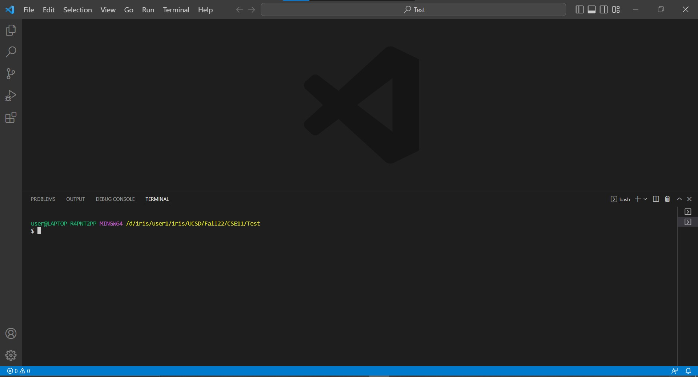

2) Type in the following text in the terminal and press Enter.

`$ ssh cs15lwi23ani@ieng6.ucsd.edu`

(`Notice`: You do not need to type in `$` because it already exists in the terminal. The letter after s is one. The letter after 5 is l, lowercase of L. Remember to replace ani by the letters in your course-specific account.)

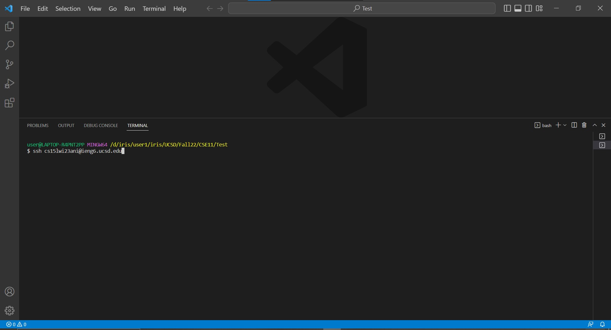

3) Logging in successfully.

(`Notice`: You do not need to type the password for your ieng6 account since we have learned how to generate SSH keys for ieng6 in the week7 lab. 
If you have not set up this, please refer to the material of the week7 lab, or ask TAs for help.)

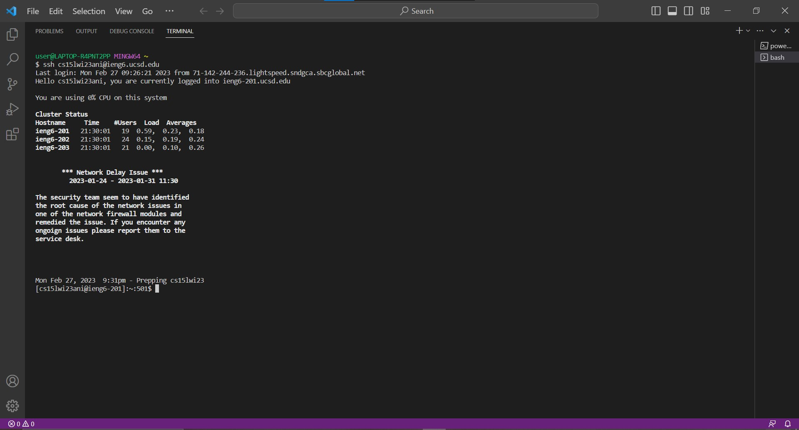

# Step 2 - Clone your fork of the repository from your Github account
## Cloned the same repository before
1) Use `Ctrl + r` to search the git clone command in the terminal and make sure the text shows up is match to the text you want to type in.

Here, the text should be `git clone git@github.com:joc044/lab7.git`.

(`Notice`: `Ctrl + r` is used to search your command history. Because I cloned the same repository before, I can use this shortcuts to reduce my typing. Moreover, the 
text you want to type in might be slightly different than mine.)

2) After making sure the text is match, press Enter.

Keys pressed: `<Ctrl + r><g><i><t><space><c><l><o><n><e><Enter>`

The `git clone git@github.com:joc044/lab7.git` command was in the first line(lately) of the search history, so I directly press `Enter` to access it.

3) Clone successfully

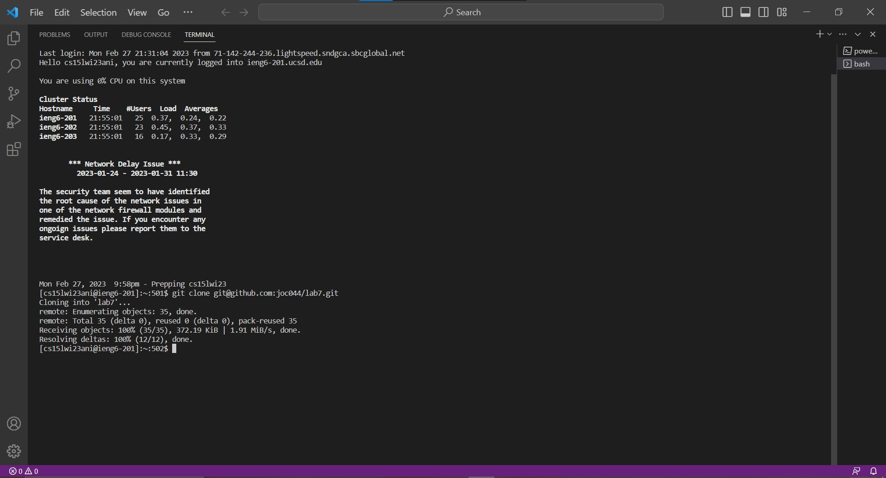

## Never cloned the repository before
1) Log into your Github account.

2) Go to the repository(lab7) that you want to clone.

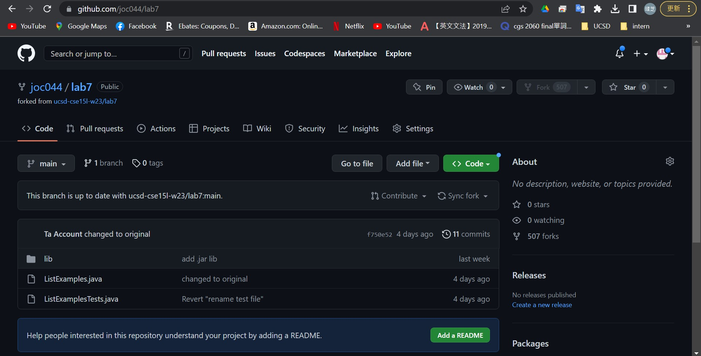

3) Click the green bottom(<> Code).

4) Click Local -> SSH.

5) Copy the following text.

`git@github.com:joc044/lab7.git`

(`Notice`: The text you copy is "similar" to mine.)

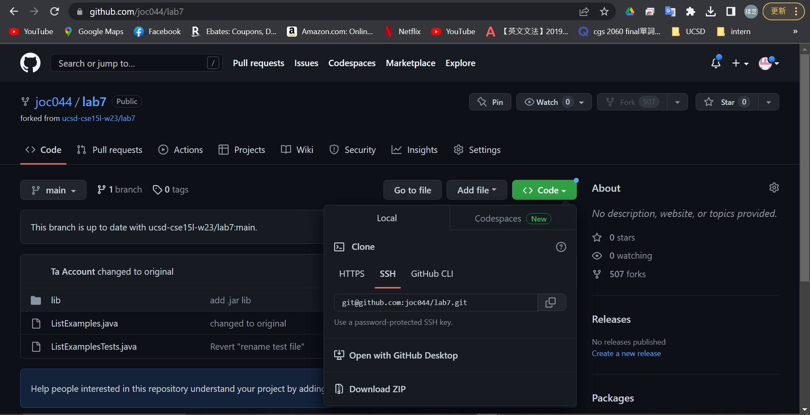

6) Go back to VScode and type the following text into your terminal.

`git clone git@github.com:joc044/lab7.git`

(`Notice`: You only need to type `git clone`. The rest of text can be pasted.)

7) After making sure the text you type is correct, press Enter.

8) Clone successfully

# Step 3 - Run the tests, demonstrating that they fail
1) Type in `cd lab7` in order to switch the current working directory to lab7.

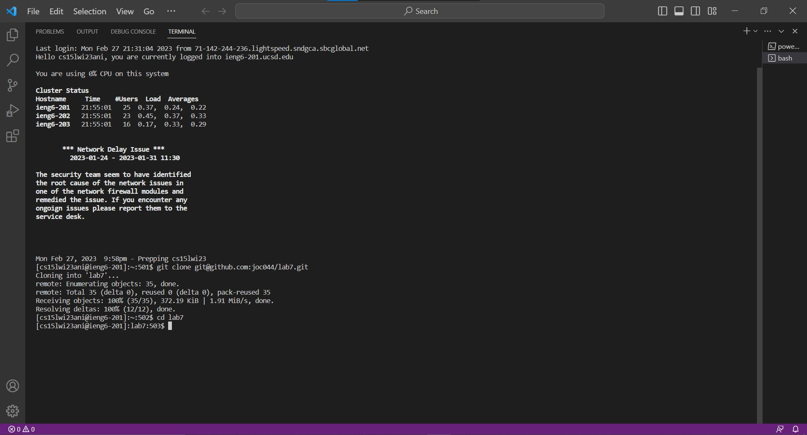

2) Use `Ctrl + r` to search the javac command in the terminal and make sure the text shows up is match to the text you want to type in.

Here, the text should be `javac -cp .:lib/hamcrest-core-1.3.jar:lib/junit-4.13.2.jar *.java`.

(`Notice`: `Ctrl + r` is used to search your command history. Because I used javac command before, I can use this shortcuts to reduce my typing.)

3) After making sure the text is match, press Enter.

Keys pressed: `<Ctrl + r><j><a><v><a><c><Enter>`

The `javac -cp .:lib/hamcrest-core-1.3.jar:lib/junit-4.13.2.jar *.java` command was in the first line(lately) of the search history, so I directly press `Enter` to access it.

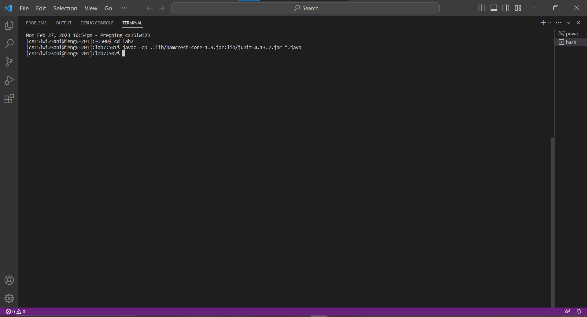

4) Use `Ctrl + r` to search the java command in the terminal and make sure the text shows up is match to the text you want to type in.

Here, the text should be `java -cp .:lib/hamcrest-core-1.3.jar:lib/junit-4.13.2.jar org.junit.runner.JUnitCore ListExamplesTests`.

(`Notice`: `Ctrl + r` is used to search your command history. Because I used java command before, I can use this shortcuts to reduce my typing.)

5) After making sure the text is match, press Enter.

Keys pressed: `<Ctrl + r><j><a><v><a><space><Enter>`

The `java -cp .:lib/hamcrest-core-1.3.jar:lib/junit-4.13.2.jar org.junit.runner.JUnitCore ListExamplesTests` command was in the first line(lately) of the search history, so I directly press `Enter` to access it.

6) After pressing Enter, the terminal runs the tests and demonstrates that they fail.

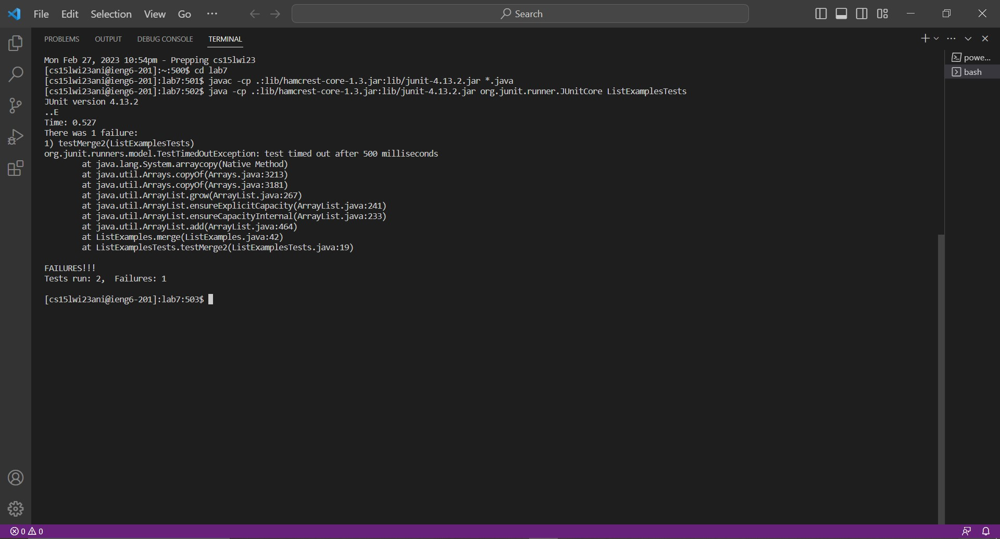

# Step 4 - Edit the code file to fix the failing test
1) Keys pressed: `<n><a><n><o><space><L><tab><.><j><tab><Enter>`

(`Notice`: After the first tab, `nano ListExamples` is auto completion. After the next tab, `nano ListExamples.java` is auto completion.)

2) nano opened.

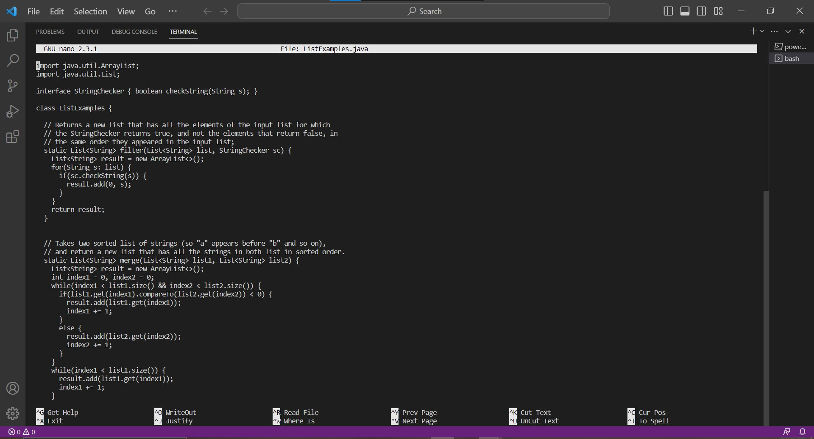

3) Edit the code. (Code is changed from `index1 += 1;` to `index2 += 1;`)

Keys pressed: `<Ctrl + w><r><e><t><u><r><n><space><r><e><s><u><l><t><Enter>`,`<Ctrl + w><r><e><t><u><r><n><space><r><e><s><u><l><t><Enter>`,`<up><up><right><right><right><right><right><right><right><right><Backspace><2><Ctrl + o><Enter>`,`<Ctrl + x>`

(`Notice`: (1)`Ctrl + w` is used to search the text(return result) I type in after. (2)I did the step `Ctrl + w` twice is because I want to find the second result of the text(return result). (3)I use the `up` and `right` arrow to access the line I want to edit, then use `Backspace` to delete the text that is wrong, and type in the correct text(2). 
(4)`Ctrl + o` is used to save the edited file. (5)`Ctrl + x` is used to exit nano.)

# Step 5 - Run the tests, demonstrating that they now succeed
1) Use `Ctrl + r` to search the javac command in the terminal and make sure the text shows up is match to the text you want to type in.

Here, the text should be `javac -cp .:lib/hamcrest-core-1.3.jar:lib/junit-4.13.2.jar *.java`.

(`Notice`: `Ctrl + r` is used to search your command history. Because I used javac command before, I can use this shortcuts to reduce my typing.)

2) After making sure the text is match, press Enter.

Keys pressed: `<Ctrl + r><j><a><v><a><c><Enter>`

The `javac -cp .:lib/hamcrest-core-1.3.jar:lib/junit-4.13.2.jar *.java` command was in the first line(lately) of the search history, so I directly press `Enter` to access it.

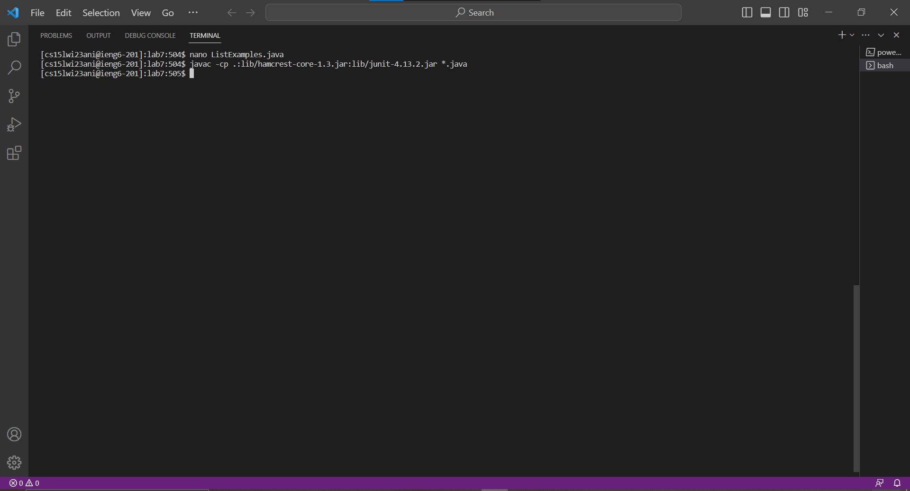

3) Use `Ctrl + r` to search the java command in the terminal and make sure the text shows up is match to the text you want to type in.

Here, the text should be `java -cp .:lib/hamcrest-core-1.3.jar:lib/junit-4.13.2.jar org.junit.runner.JUnitCore ListExamplesTests`.

(`Notice`: `Ctrl + r` is used to search your command history. Because I used java command before, I can use this shortcuts to reduce my typing.)

4) After making sure the text is match, press Enter.

Keys pressed: `<Ctrl + r><j><a><v><a><space><up><Enter>`

The `java -cp .:lib/hamcrest-core-1.3.jar:lib/junit-4.13.2.jar org.junit.runner.JUnitCore ListExamplesTests` command was 1 up in the search history,so I used up arrow to access it.

5) After pressing Enter, the terminal runs the tests and demonstrates that they succeed.

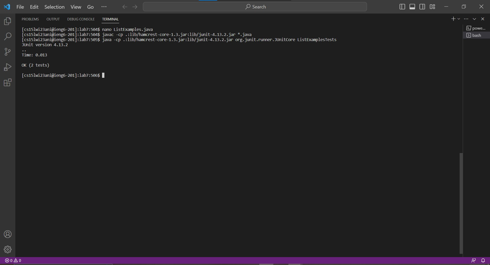

# Step 6 - Commit and push the resulting change to your Github account
1) Use `Ctrl + r` to search the git add command in the terminal and make sure the text shows up is match to the text you want to type in.

Here, the text should be `git add ListExamples.java`.

(`Notice`: `Ctrl + r` is used to search your command history. Because I used git add command before, I can use this shortcuts to reduce my typing.)

2) After making sure the text is match, press Enter.

Keys pressed: `<Ctrl + r><g><i><t><space><a><Enter>`

The `git add ListExamples.java` command was in the first line(lately) of the search history, so I directly press `Enter` to access it.

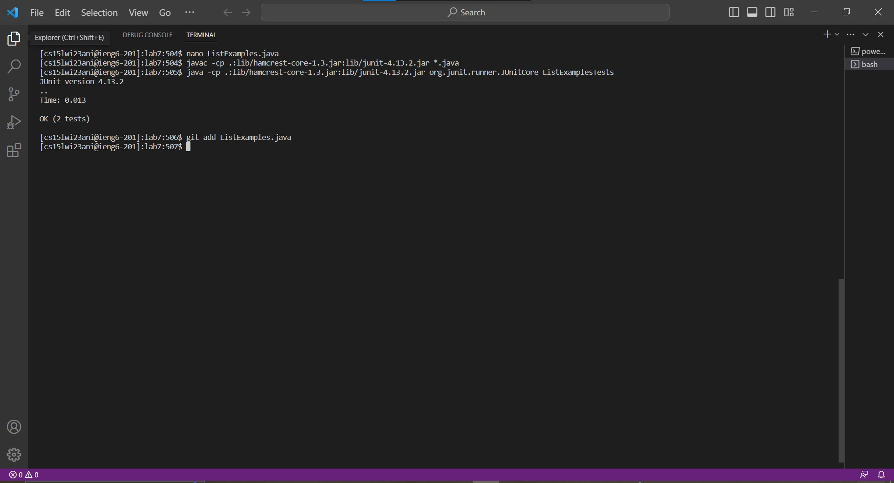

3) Use `Ctrl + r` to search the git commit command in the terminal and make sure the text shows up is match to the text you want to type in.

Here, the text should be `git commit -m "Updated"`.

(`Notice`: `Ctrl + r` is used to search your command history. Because I used git commit command before, I can use this shortcuts to reduce my typing.)

4) After making sure the text is match, press Enter.

Keys pressed: `<Ctrl + r><g><i><t><space><c><o><Enter>`

The `git commit -m "Updated"` command was in the first line(lately) of the search history, so I directly press `Enter` to access it.

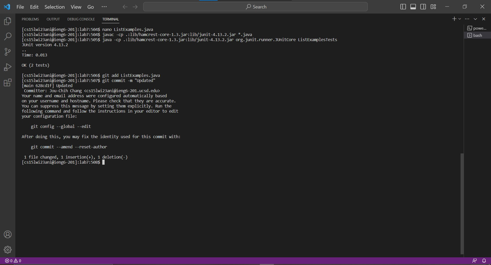

5) Use `Ctrl + r` to search the git push command in the terminal and make sure the text shows up is match to the text you want to type in.

Here, the text should be `git push origin main`.

(`Notice`: `Ctrl + r` is used to search your command history. Because I used git push command before, I can use this shortcuts to reduce my typing.)

6) After making sure the text is match, press Enter.

Keys pressed: `<Ctrl + r><g><i><t><space>
<Enter>`

The `git push origin main` command was in the first line(lately) of the search history, so I directly press `Enter` to access it.

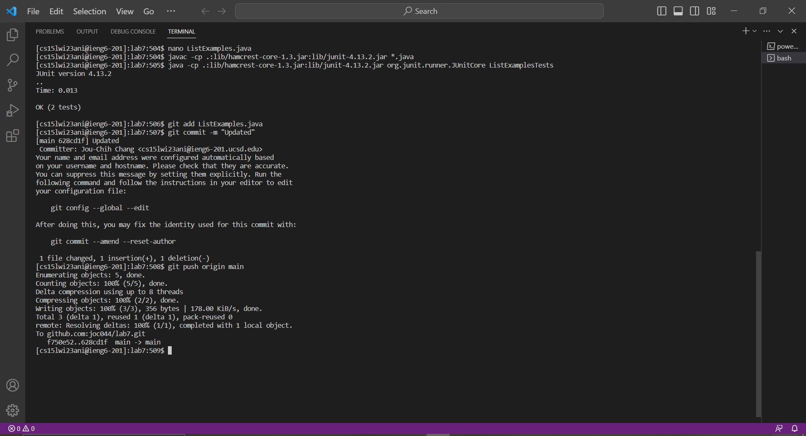
