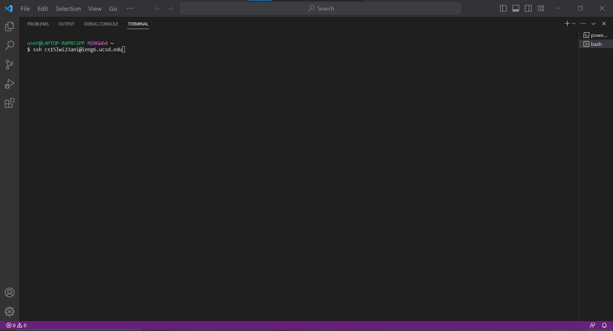
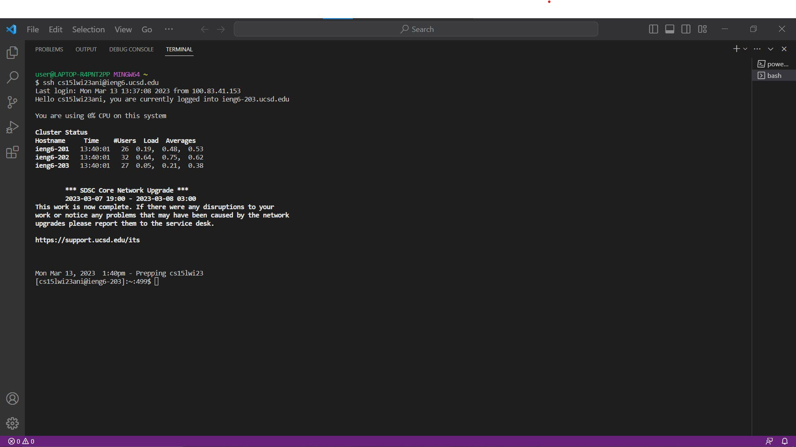
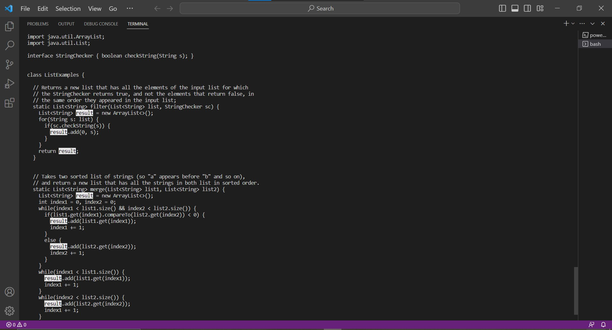
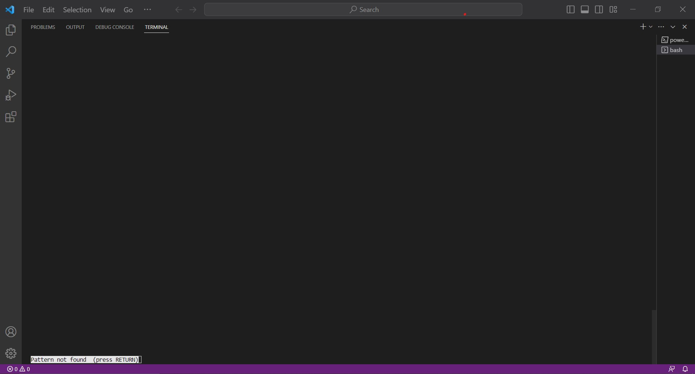
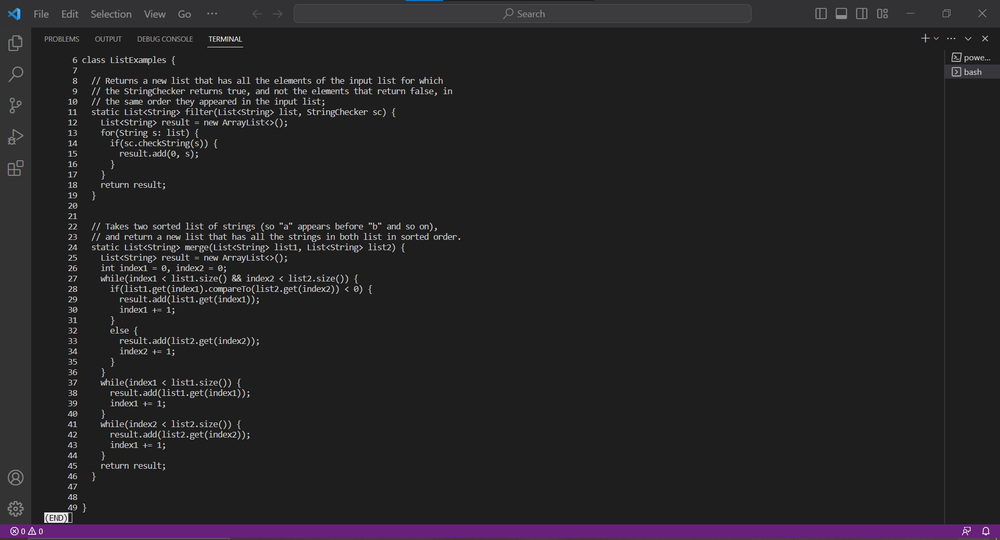
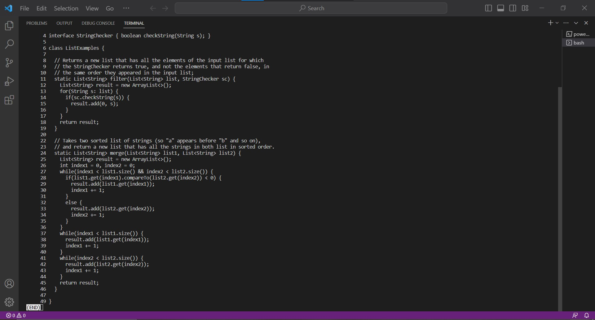

Hello, everyone. Today we will discuss the `less` command-line options. `less` is a useful command that shows a file's contents to the user.

(`The thing you need to know before starting`: Before starting to explore `less` command-line options, 
you should know that whenever you want to quit `less`, just press `q` to quit.)

## Before start:
In order to show the `less` command-line options and its output easily, we need to set up our evironment first.

1. Use Ctrl or Command + ` to open a new bash terminal in Visual Studio Code.

2. Log into your course-specific ieng6 account:



(`Notice`:You do not need to type in `$` because it already exists in the terminal. 
The letter after s is one. The letter after 5 is l, lowercase of L. 
Remember to replace ani by the letters in your course-specific account.)

3. Successful log in:



(`Notice`: You do not need to type the password for your ieng6 account since we have learned how to generate SSH keys for ieng6 in the week7 lab. 
If you have not set up this, please refer to the material of the week7 lab, or ask TAs for help.)

4. Use `cd lab7` to switch the current working directory to lab7.

(`Notice`: If you do not have lab7 in your working directory, you can use this URL(`https://github.com/ucsd-cse15l-w23/lab7.git`) to clone it.)
 
5. Complete set up the evironment and ready for showing less command-line.

# The general syntax for the `less` command:
1) `less file_path` is used to load a file into `less` and show the file's contents to the user.

2) `less file_path1 file_path2` is used to load multiple files into `less` and show the files' contents to the user.

(`Notice`: When we load multiple files into `less`, `:` + `n` in `less` is used to view the next file. `:` + `p` in `less` is used to view the previous file.)

## Example:
1) Open one file at a time

command:
```
less ListExamples.java
```
`less ListExamples.java` loads ListExamples.java into `less` and shows the contents of ListExamples.java to us.

output:
```
import java.util.ArrayList;
import java.util.List;

interface StringChecker { boolean checkString(String s); }
import java.util.ArrayList;
import java.util.ArrayList;
import java.util.List;

interface StringChecker { boolean checkString(String s); }

class ListExamples {

  // Returns a new list that has all the elements of the input list for which
  // the StringChecker returns true, and not the elements that return false, in
  // the same order they appeared in the input list;
  static List<String> filter(List<String> list, StringChecker sc) {
    List<String> result = new ArrayList<>();
    for(String s: list) {
      if(sc.checkString(s)) {
        result.add(0, s);
      }
    }
    return result;
  }


  // Takes two sorted list of strings (so "a" appears before "b" and so on),
  // and return a new list that has all the strings in both list in sorted order.
  static List<String> merge(List<String> list1, List<String> list2) {
    List<String> result = new ArrayList<>();
    int index1 = 0, index2 = 0;
    while(index1 < list1.size() && index2 < list2.size()) {
      if(list1.get(index1).compareTo(list2.get(index2)) < 0) {
        result.add(list1.get(index1));
        index1 += 1;
      }
      else {
        result.add(list2.get(index2));
        index2 += 1;
      }
    }
    while(index1 < list1.size()) {
      result.add(list1.get(index1));
      index1 += 1;
    }
    while(index2 < list2.size()) {
      result.add(list2.get(index2));
      index1 += 1;
    }
    return result;
  }


}
```
The output is the contents of ListExamples.java.

2) Open multiple files at a time

command:
```
less ListExamples.java ListExamplesTests.java 
```
`less ListExamples.java ListExamplesTests.java` loads ListExamples.java and ListExamplesTests.java into `less` and shows their contents to us.

output for ListExamples.java:
```
import java.util.ArrayList;
import java.util.List;

interface StringChecker { boolean checkString(String s); }
import java.util.ArrayList;
import java.util.ArrayList;
import java.util.List;

interface StringChecker { boolean checkString(String s); }

import java.util.ArrayList;
import java.util.List;

interface StringChecker { boolean checkString(String s); }

class ListExamples {

  // Returns a new list that has all the elements of the input list for which
  // the StringChecker returns true, and not the elements that return false, in
  // the same order they appeared in the input list;
  static List<String> filter(List<String> list, StringChecker sc) {
    List<String> result = new ArrayList<>();
    for(String s: list) {
      if(sc.checkString(s)) {
        result.add(0, s);
      }
    }
    return result;
  }


  // Takes two sorted list of strings (so "a" appears before "b" and so on),
  // and return a new list that has all the strings in both list in sorted order.
  static List<String> merge(List<String> list1, List<String> list2) {
    List<String> result = new ArrayList<>();
    int index1 = 0, index2 = 0;
    while(index1 < list1.size() && index2 < list2.size()) {
      if(list1.get(index1).compareTo(list2.get(index2)) < 0) {
        result.add(list1.get(index1));
        index1 += 1;
      }
      else {
        result.add(list2.get(index2));
        index2 += 1;
      }
    }
    while(index1 < list1.size()) {
      result.add(list1.get(index1));
      index1 += 1;
    }
    while(index2 < list2.size()) {
      result.add(list2.get(index2));
      index1 += 1;
    }
    return result;
  }


}
```
output for ListExamplesTests.java:
```
import static org.junit.Assert.*;
import org.junit.*;
import java.util.*;
import java.util.ArrayList;


public class ListExamplesTests {
        @Test(timeout = 500)
        public void testMerge1() {
                List<String> l1 = new ArrayList<String>(Arrays.asList("x", "y"));
                List<String> l2 = new ArrayList<String>(Arrays.asList("a", "b"));
                assertArrayEquals(new String[]{ "a", "b", "x", "y"}, ListExamples.merge(l1, l2).toArray());
        }

        @Test(timeout = 500)
        public void testMerge2() {
                List<String> l1 = new ArrayList<String>(Arrays.asList("a", "b", "c"));
                List<String> l2 = new ArrayList<String>(Arrays.asList("c", "d", "e"));
                assertArrayEquals(new String[]{ "a", "b", "c", "c", "d", "e" }, ListExamples.merge(l1, l2).toArray());
        }

}
```
The output is the contents of ListExamples.java and ListExamplesTests.java.

3) Conclusion:

The `less` command is useful because we can open a lot of files at one time instead of opening them one by one.

(`Source`: https://phoenixnap.com/kb/less-command-in-linux)

# The first `less` command-line options is `-N`:
`-N` is used to show a file with line numbers at the beginning of each line.

## Example:
1) Show the exist file.

command:
```
less -N ListExamples.java
```

`less -N ListExamples.java` shows ListExamples.java with line numbers at the beginning of each line.

output:
```
      1 import java.util.ArrayList;
      2 import java.util.List;
      3
      4 interface StringChecker { boolean checkString(String s); }
      5
      6 class ListExamples {
      7
      8   // Returns a new list that has all the elements of the input list for which
      9   // the StringChecker returns true, and not the elements that return false, in
     10   // the same order they appeared in the input list;
     11   static List<String> filter(List<String> list, StringChecker sc) {
     12     List<String> result = new ArrayList<>();
     13     for(String s: list) {
     14       if(sc.checkString(s)) {
     15         result.add(0, s);
     16       }
     17     }
     18     return result;
     19   }
     20
     21
     22   // Takes two sorted list of strings (so "a" appears before "b" and so on),
     23   // and return a new list that has all the strings in both list in sorted order.
     24   static List<String> merge(List<String> list1, List<String> list2) {
     25     List<String> result = new ArrayList<>();
     26     int index1 = 0, index2 = 0;
     27     while(index1 < list1.size() && index2 < list2.size()) {
     28       if(list1.get(index1).compareTo(list2.get(index2)) < 0) {
     29         result.add(list1.get(index1));
     30         index1 += 1;
     31       }
     32       else {
     33         result.add(list2.get(index2));
     34         index2 += 1;
     35       }
     36     }
     37     while(index1 < list1.size()) {
     38       result.add(list1.get(index1));
     39       index1 += 1;
     40     }
     41     while(index2 < list2.size()) {
     42       result.add(list2.get(index2));
     43       index1 += 1;
     44     }
```
We can see the output has line numbers at the beginning of each line. 
It is useful because when we review the code, we can easy to know which line of code we need to modify.

2) Show the non-exist file.

command:
```
less -N lab7.java
```

output:
```
lab7.java: No such file or directory
```
Because lab7.java does not exist in lab7 directory, the output shows us that it cannot find the file.

(`Source`: https://phoenixnap.com/kb/less-command-in-linux)

# The second `less` command-line options is `-p`:
`-p` is used to show the file and highlight the string we type after -p.

(`Notice`: The string we type in is case-sensitive.)

## Example:
1) Search for the string that exists in the file.

command:
```
less -presult ListExamples.java
```

`less -presult ListExamples.java` shows ListExamples.java and highlight all of 'result'.  

output:


We can see the output highlight all of 'result'.

(`Notice`: This output do not have line numbers at the beginning of each line because we do not use the option `-N`.)

2) Search for the string that does not exist in the file.

command:
```
less -pRESULT ListExamples.java
```

output:


The output is blank because 'RESULT' do not exist in the file.

(`Notice`: We can still view the file by pressing Enter after the output is shown.)

3) Conclusion:

Through the above examples, we are sure that the string we type in for searching is case-sensitive.
This less command option is useful because we can easily find the string we want in the file.

(`Source`: https://phoenixnap.com/kb/less-command-in-linux)

# The third `less` command-line options is `-s`:
`-s` is used to squeeze the blank lines into one blank line in the file when it shows the file.

## Example:
command:
```
less -N -s ListExamples.java
```
`less -N -s ListExamples.java` squeezes the blank lines into one blank line when it shows ListExamples.java. 

output(before):


output(after):


We can see that line 21 and 48 are missing in the output(after) because this command-line option squeezes the blank lines into one blank line. 
Therefore, when we view ListExamples.java, there are some lines missing. This command-line option is useful because it can show more contents in screen.

(`Source`: https://phoenixnap.com/kb/less-command-in-linux)

# The fourth `less` command-line options is `-X`:
`-X` is used to print a file's contents on the terminal. 
Even we quit `less`, we still can see the file's contents on the terminal.

(`Notice`: `less -X` is similar to `cat`. Both print the file's contents on the terminal.)

## Example:
command:
```
less -X ListExamples.java
```
`less -X ListExamples.java` prints the contents of ListExamples.java on the terminal.

output:
```
import java.util.ArrayList;
import java.util.List;

interface StringChecker { boolean checkString(String s); }

class ListExamples {

  // Returns a new list that has all the elements of the input list for which  
  // the StringChecker returns true, and not the elements that return false, in
  // the same order they appeared in the input list;
  static List<String> filter(List<String> list, StringChecker sc) {
    List<String> result = new ArrayList<>();
    for(String s: list) {
      if(sc.checkString(s)) {
        result.add(0, s);
      }
    }
    return result;
  }


  // Takes two sorted list of strings (so "a" appears before "b" and so on),
  // and return a new list that has all the strings in both list in sorted order.    
  static List<String> merge(List<String> list1, List<String> list2) {
    List<String> result = new ArrayList<>();
    int index1 = 0, index2 = 0;
    while(index1 < list1.size() && index2 < list2.size()) {
      if(list1.get(index1).compareTo(list2.get(index2)) < 0) {
        result.add(list1.get(index1));
        index1 += 1;
      }
      else {
        result.add(list2.get(index2));
        index2 += 1;
      }
    }
    while(index1 < list1.size()) {
      result.add(list1.get(index1));
      index1 += 1;
    }
    while(index2 < list2.size()) {
      result.add(list2.get(index2));
      index1 += 1;
    }
    return result;
  }


}
```
The output is the contents of ListExamples.java.
It is useful because we do not need to repeatly load a file into `less` and quit `less`.

(`Source`: https://phoenixnap.com/kb/less-command-in-linux)
